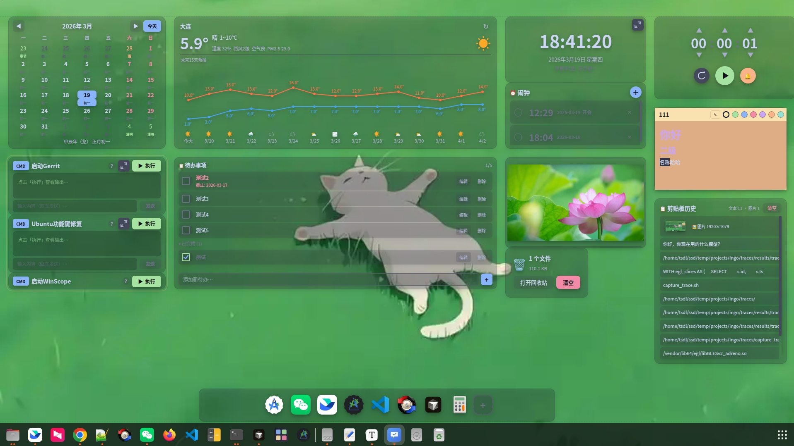
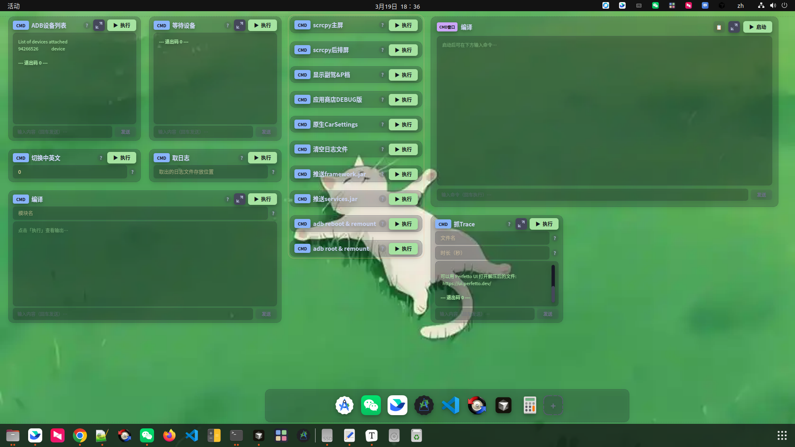
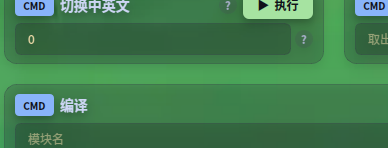

# ⚡ FastPanel

基于 PyQt5 的桌面 Widget 引擎，支持 20+ 种可定制组件，采用 Catppuccin 主题配色。默认以桌面模式运行，窗口置于壁纸层，不影响系统桌面环境（GNOME 状态栏、Dock 等完全不受影响）。


## 截图

### 桌面模式全景



> 双显示器独立面板 — 左屏显示默认面板，右屏显示 ADB 工具面板

### 桌面组件概览



> 各类组件在桌面上自由布局，支持拖拽、调整大小、分组

### 组件展示

<table>
<tr>
<td align="center"><b>CMD 命令</b><br><br>执行命令并显示输出</td>
<td align="center"><b>CMD 窗口</b><br><br>交互式终端</td>
</tr>
<tr>
<td align="center"><b>Dock 栏</b><br><br>自定义应用启动栏</td>
<td align="center"><b>便签</b><br><br>多彩便签，支持 Markdown</td>
</tr>
<tr>
<td align="center"><b>回收站</b><br><br>回收站状态，支持打开和清空</td>
<td align="center"><b>时钟</b><br><br>多种子类型：本地/世界/秒表/计时器/闹钟</td>
</tr>
</table>

## 运行模式

| 模式 | 命令 | 说明 |
|---|---|---|
| **桌面模式**（默认） | `python3 main.py` 或 `python3 main.py --desktop` | 全屏置底，作为桌面层运行，右键菜单操作 |
| 窗口模式 | `python3 main.py --windowed` | 传统窗口，带工具栏和标签栏 |

### 桌面模式特性

- 窗口类型设为 `_NET_WM_WINDOW_TYPE_DESKTOP`，始终在所有窗口之下
- 不出现在任务栏和 Alt+Tab 中
- GNOME 状态栏、Dock、通知等系统功能完全不受影响
- 自动禁用 GNOME 桌面图标扩展 (ding) 避免冲突，退出时自动恢复
- 通过**右键桌面空白区域**访问所有操作（创建组件、切换面板、设置等）
- **系统托盘图标**提供快速控制（显示/隐藏、设置、退出）
- **单实例保护** — 全局只允许一个 FastPanel 进程运行

### 平台支持

| 平台 | 状态 | 说明 |
|---|---|---|
| Linux X11 (Ubuntu 18/20/22/24) | ✅ 完全支持 | 推荐平台 |
| Linux Wayland | ⚠️ 降级支持 | WindowStaysOnBottom 模式 |
| Windows 10/11 | ⚠️ 基础支持 | WorkerW 嵌入 |
| macOS | ⚠️ 基础支持 | 桌面层级 |

## 功能特性

### 组件类型（20+）

| 类型 | 说明 |
|---|---|
| **系统监控** | CPU/内存/磁盘/网络实时监控，折线图展示，多种子类型（CPU、内存、综合概览） |
| **时钟** | 本地时钟、世界时钟、秒表、计时器、闹钟 — 支持全屏翻页时钟 |
| **天气** | 实时天气信息，温度曲线、多日预报、空气质量指数 |
| **日历** | 月历视图，支持农历、节假日和节气 |
| **便签** | 多彩便签，支持 Markdown 渲染 |
| **待办** | Todo 列表，支持分类和完成状态 |
| **媒体播放** | MPRIS 协议控制系统媒体播放器（播放/暂停/上下首） |
| **快捷操作** | 锁屏、音量控制（滑块+静音）、文件管理器、回收站、截图等 |
| **应用启动器** | 从系统 .desktop 文件扫描已安装应用，支持搜索和启动 |
| **剪贴板历史** | 剪贴板监控，支持文本和图片历史，快捷键弹出并直接粘贴 |
| **书签管理** | 收藏网址，支持图标和分类 |
| **相册** | 本地图片浏览，支持上一张/下一张导航 |
| **计算器** | 内置科学计算器 |
| **回收站** | 显示回收站状态，支持打开和清空 |
| **RSS 阅读器** | RSS/Atom 订阅源阅读 |
| **CMD 命令** | 执行命令并显示输出，支持动态参数 `($)` 占位符 |
| **CMD 窗口** | 交互式终端，支持前置命令 |
| **快捷方式** | 启动应用程序、脚本或打开文件 |
| **Dock 栏** | 自定义应用启动栏，支持拖拽排序 |

### 时钟子类型

| 子类型 | 说明 |
|---|---|
| **时钟** | 本地时间 + 日期 + 农历，支持全屏翻页时钟 |
| **世界时钟** | 显示指定时区时间及与本地时差 |
| **秒表** | 毫秒精度计时，支持分段记录 |
| **计时器** | 倒计时，支持弹窗 + 声音提醒，数值持久化 |
| **闹钟** | 设置日期/时间，重复模式（单次/每天/工作日/周末），全屏提醒 |

### 面板管理

- **多面板** — 创建多个面板，自由切换
- **多显示器独立面板** — 每个显示器可显示不同面板，互不影响
- 首次检测到多显示器时自动引导设置
- 组件自由拖拽、调整大小，网格吸附对齐
- 组件分组 / 复制 / 导出导入
- 锁定布局防止误操作
- 安全边距避让系统状态栏和 Dock

### 壁纸管理

| 模式 | 说明 |
|---|---|
| 随主题颜色 | 背景色跟随当前主题 |
| 单个壁纸 | 支持复制和平铺模式 |
| 每个显示器不同壁纸 | 为每个显示器单独设置壁纸 |
| 渐变色 | 自定义渐变色背景 |
| 壁纸轮播 | 从指定目录自动轮换壁纸 |

### 主题

内置 5 套主题，所有组件实时跟随主题切换：

| 主题 | 风格 |
|---|---|
| **Catppuccin Mocha** | 暖色调深色主题（默认） |
| **Catppuccin Latte** | 浅色主题 |
| **Nord** | 北极蓝色调 |
| **Dracula** | 经典紫色调深色 |
| **One Dark** | Atom 风格深色 |

### 全局快捷键

| 快捷键 | 功能 |
|---|---|
| `Ctrl+Shift+D` | 显示/隐藏桌面 |
| `Ctrl+Alt+V` | 弹出剪贴板历史（选中可直接粘贴到输入框） |
| `Ctrl+Shift+S` | 打开设置 |
| 可自定义 | 在设置中点击输入框，弹出捕获窗口自动识别按键组合 |

### 组件透明度

所有组件支持统一透明度设置，背景区域跟随透明度变化，文字和图标保持不透明。

## 安装

### 一键安装（Linux 推荐）

```bash
cd FastPanel
chmod +x install.sh
./install.sh
```

安装脚本会自动安装依赖、**添加到系统应用程序列表**、可选设置开机自启。

> 详细安装说明（含 Windows / macOS）请参考 [INSTALL.md](INSTALL.md)

### 手动安装

```bash
# 安装依赖
pip install PyQt5 psutil python-xlib

# 桌面模式（推荐）
python3 main.py --desktop

# 窗口模式
python3 main.py --windowed
```

## 使用指南

### 桌面模式

1. **右键桌面空白区域** → 展开「新建组件」菜单，直接选择组件类型
2. **拖拽组件** 调整位置，**拖拽边角** 调整大小
3. **右键组件** 可编辑、复制、删除、分组
4. **右键桌面** → 「面板」管理多面板（新建、切换、重命名、删除）
5. **右键桌面** → 「设置」调整主题、壁纸、快捷键、透明度等
6. **系统托盘图标** 提供快速控制

### 多显示器设置

1. 首次启动检测到多显示器时，自动弹出引导对话框
2. 选择「所有显示器共用一个面板」或「每个显示器独立面板」
3. 独立面板模式下，在不同显示器上右键 → 「面板」可查看和切换各显示器的面板分配
4. 可在设置中随时修改显示器模式

### 窗口模式

1. 顶部工具栏操作（新建、导入导出、网格、锁定、设置）
2. 底部标签栏管理面板

## 项目结构

```
FastPanel/
├── main.py             # 主程序（所有逻辑）
├── data.json           # 组件数据（自动生成）
├── settings.json       # 用户设置（自动生成）
├── requirements.txt    # 依赖
├── fastpanel.svg       # 应用图标
├── cities.json         # 城市数据（天气功能）
├── install.sh          # Linux 一键安装脚本
├── uninstall.sh        # Linux 卸载脚本
├── INSTALL.md          # 详细安装手顺
└── screenshots/        # 截图
    ├── desktop-full.png
    ├── screen-0.png
    ├── screen-1.png
    └── components/
        ├── calendar.png
        ├── weather.png
        ├── clock.png
        ├── todo.png
        ├── note.png
        ├── cmd.png
        ├── cmd_window.png
        ├── dock.png
        ├── clipboard.png
        ├── gallery.png
        └── trash.png
```

## 系统要求

- Python 3.8+
- PyQt5 5.15+
- Linux (Ubuntu 18.04+ 推荐) / Windows 10+ / macOS
- xprop（Linux X11 桌面模式，通常已预装）
- PulseAudio / PipeWire（音量控制、闹钟/计时器声音提醒）

## 已知限制

- Wayland 下全局快捷键不可用（X11 专属功能）
- 剪贴板粘贴功能依赖 `python-xlib`（X11 环境）
- macOS 和 Windows 下部分桌面集成功能受限
